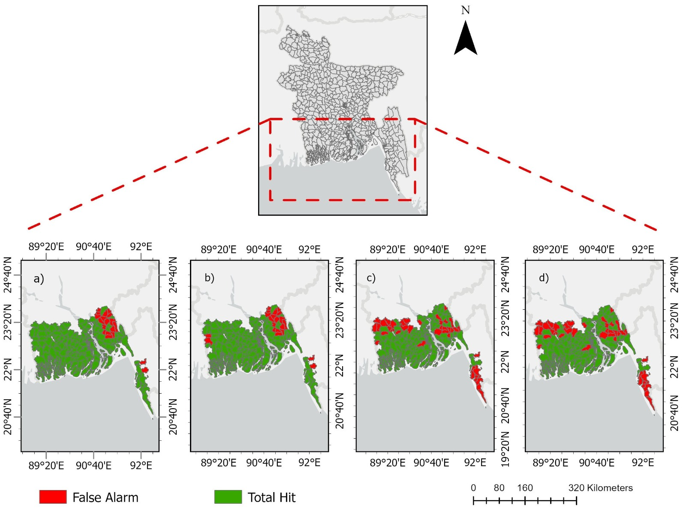

# IBF-Analysis

**A multi-sector impact-forecasting and validation framework for anticipatory action against tropical cyclones in Bangladesh**

Anticipatory action against tropical cyclones requires impact forecasts that can identify where damage is most likely before landfall. This repository accompanies research developed by Raihanul Haque Khan, Asif Bin Noor, Md. Ibrahim Abdullah, and Raisa Binte Ahmed at **RIMES** (Regional Integrated Multi-Hazard Early Warning System for Africa and Asia).

The framework integrates forecast hazards, baseline vulnerability, and sector-specific exposure into normalized housing and agricultural impact scores at ADM3/Upazila level in Bangladesh. Forecasts at 24-hour, 48-hour, and 72-hour lead times are evaluated against post-event damage records from the Department of Disaster Management (DDM) for Cyclones Remal, Midhili, and Sitrang.

The repository now contains three connected parts:

1. **Forecast impact preparation** from hazard, vulnerability, and exposure inputs.
2. **Impact forecast validation and calibration** against observed DDM damage.
3. **Standalone predictor comparison (ablation)** to test whether the full composite provides information beyond hazard alone or vulnerability alone.


## What this framework does

The operational impact forecast combines three groups of information:

- **Baseline vulnerability:** INFORM Subnational Risk Index for Bangladesh.
- **Forecast hazard:** wind gust, rainfall, and storm surge.
- **Sector exposure:** building counts for housing and fAPAR-based agricultural exposure.

These inputs are used to produce normalized sector-specific impact scores:

- `Norm_Impact_House`
- `Norm_Impact_fAPAR`

The validation workflow then compares those forecast scores with observed DDM damage using continuous, binary, ordinal, and spatial verification methods.

Hazard-component weights in the operational impact formulation are event dependent, as described in the manuscript methodology. The separate hazard-only ablation analysis described below is a diagnostic comparison and uses its own fixed weighted hazard baseline.

## Supported cyclone cases

| Cyclone | Landfall | 1-day lead | 2-day lead | 3-day lead |
|---|---|---:|---:|---:|
| Remal | 26 May 2024 | ✓ | ✓ | ✓ |
| Sitrang | 24 Oct 2022 | ✓ | ✓ | ✓ |
| Midhili | 17 Nov 2023 | ✓ | ✓ | ✓ |

Repository lead-time identifiers are `1dlt`, `2dlt`, and `3dlt`.

## Workflow

```text
Hazard forecasts
    + Vulnerability
    + Sector exposure
            |
            v
forecasted_impact_engine.py
            |
            v
Forecast impact workbook
            |
            v
Validation and calibration
    - Continuous association
    - ROC/AUC
    - Mann-Whitney U
    - No-Impact threshold optimization
    - Quadratic-weighted Kappa calibration
    - Exact / Adjacent / Off-category agreement
    - Spatial Hit / Miss / False Alarm / True Negative verification
            |
            v
Standalone predictor comparison
    Composite vs Vulnerability-only vs Hazard-only
```

## Forecasted Impact Engine

`scripts/forecasted_impact_engine.py` prepares the forecast impact workbook by matching hazard, vulnerability, and exposure inputs using ADM3 P-Codes.

### Inputs

The sample inputs are stored under:

```text
data/sample/impact forecast data sample/
├── Forecasted_Impact_Dummy.xlsx
├── building_count.xlsx
├── faapar.xlsx
├── rainfall.xlsx
├── stormsurge.xlsx
├── vulnerability.xlsx
└── windgust.xlsx
```

The script processes:

- **Wind gust:** maximum forecast value across the selected forecast records, converted from m/s to km/h.
- **Rainfall:** accumulated rainfall difference from the specified forecast rows, converted to mm.
- **Storm surge:** matched directly by ADM3 P-Code.
- **Vulnerability:** matched by ADM3 P-Code.
- **fAPAR:** matched by ADM3 P-Code.
- **Building exposure:** matched by ADM3 P-Code.

The values are written into `Forecasted_Impact_Dummy.xlsx`, preserving the impact-template structure, and saved as:

```text
outputs/Forecasted_Impact.xlsx
```

Run from the repository root:

```bash
python scripts/forecasted_impact_engine.py
```

The script prints the number of input records and successful ADM3 P-Code matches before saving the output.

## Validation suite

Forecast impact scores are evaluated against DDM post-event damage records using complementary methods.

### Continuous association

Continuous forecast scores are compared with observed damage for complete positive forecast-observation pairs using:

- Ordinary least squares
- Pearson correlation
- Spearman rank correlation
- Kendall rank correlation
- `log1p` transformation of observed damage where applied in the analysis

### Threshold-independent discrimination

- ROC curves
- Area under the ROC curve (AUC)
- One-sided Mann-Whitney U test

These analyses test whether the continuous forecast signal discriminates impacted from non-impacted locations without fixing a single decision threshold.

### No-Impact threshold optimization

Candidate percentile thresholds are evaluated using:

```text
Decision Score = CSI - FAR - |Bias - 1|
```

The selected threshold defines the calibrated No-Impact decision boundary for the evaluated event, sector, and lead time.

Because the same DDM observations are used for threshold selection and threshold-dependent verification, POD, FAR, CSI, Frequency Bias, and Accuracy at the selected threshold are interpreted as **calibration diagnostics**, not independent out-of-sample skill estimates.

### Severity calibration

Observed DDM damage is converted into ordered severity classes:

```text
No Impact
Low
Medium
High
```

For each damage variable, one fixed DDM Low/High cut pair is selected for a cyclone by maximizing the **mean quadratic-weighted Kappa across 1dlt, 2dlt, and 3dlt**.

The same DDM cut pair is then applied unchanged to all three lead times.

Agreement is summarized using:

- Quadratic-weighted Kappa
- Exact-category agreement
- Adjacent-category agreement
- Off-category error

### Spatial verification

Forecast and observed categories are matched at ADM3/Upazila level and classified as:

- Hit
- Miss
- False Alarm
- True Negative

Spatial outputs use the Bangladesh ADM3 boundary data included under `data/reference/bangladesh_adm3/`.

## Standalone Predictor Comparison (Ablation)

The repository also includes an ablation workflow to determine whether the full composite impact forecast adds information beyond hazard alone or vulnerability alone.

The script is:

```text
scripts/ablation_kappa_comparison_all_cyclones.py
```

It processes **Remal, Midhili, and Sitrang in one run** and compares three predictors:

| Predictor | Definition |
|---|---|
| Composite | Existing sector-specific IBF composite score |
| Vulnerability alone | `Norm_Vul` |
| Hazard-only (weighted) | `0.35 × Norm_Wind Gust + 0.35 × Norm_Rainfall + 0.30 × Norm_Storm Surge` |

For a fair comparison, vulnerability-only and hazard-only scores use the **same lead-specific and sector-specific forecast severity boundaries derived from the operational composite forecast**. The forecast-side thresholds are therefore not independently fitted against DDM for the standalone predictors.

For each predictor and damage variable, the DDM Low/High cut pair is calibrated using the same three-lead quadratic-weighted Kappa search used in the main severity-calibration workflow.

Run:

```bash
python scripts/ablation_kappa_comparison_all_cyclones.py
```

The script creates **Excel outputs only**:

```text
outputs/remal/Ablation_Kappa_Comparison/
└── Remal_Ablation_Kappa_Comparison.xlsx

outputs/midhili/Ablation_Kappa_Comparison/
└── Midhili_Ablation_Kappa_Comparison.xlsx

outputs/sitrang/Ablation_Kappa_Comparison/
└── Sitrang_Ablation_Kappa_Comparison.xlsx
```

Each workbook contains:

```text
All_Comparisons
Housing_NoTotal
Housing_Amt
Agri_Land
Agri_Amt
Audit
Method
```

The comparison tables report:

```text
Predictor
Lead
n
DDM cut-points (Low / High)
Kappa
Exact %
Adjacent %
Off-Cat. %
```

### Cross-cyclone ablation summary

Using the current three-cyclone sample outputs:

| Predictor | Overall mean Kappa | Housing mean Kappa | Agriculture mean Kappa |
|---|---:|---:|---:|
| Composite | **0.3403** | 0.2816 | **0.3991** |
| Hazard-only (weighted) | 0.2918 | **0.3245** | 0.2591 |
| Vulnerability alone | 0.2255 | 0.2349 | 0.2161 |

The ablation result supports a **sector-specific and event-dependent interpretation**. The Composite has the highest overall mean Kappa and the strongest agricultural performance across the three cyclones, while weighted hazard alone has the highest cross-cyclone housing mean Kappa. Vulnerability alone is generally weaker, although individual event-sector combinations can differ.

Accordingly, the analysis should not be interpreted as evidence that the Composite universally outperforms every simpler predictor. Its clearest added value is for agricultural impact severity and in the aggregate cross-cyclone comparison.

## Example outputs

The figures below are examples generated from the repository sample data.

**Discrimination skill, Cyclone Remal, 24-hour lead:**


**No-Impact threshold optimization, Cyclone Remal, housing, 24-hour lead:**


**Severity calibration, Cyclone Remal, 24-hour lead:**


**Spatial verification across the three cyclones:**



## Results at a glance

The table below illustrates the calibrated categorical comparison for Cyclone Remal.

| Cyclone | Lead Time | Variable | n | Exact Match (n) | Exact Match (%) | Adjacent (n) | Within-1-Class (n) | Within-1-Class (%) | Off-Category Error (%) |
|---|---|---|---:|---:|---:|---:|---:|---:|---:|
| Remal | 24h | House: No. Damaged Households | 154 | 92 | 59.7% | 54 | 146 | 94.8% | 5.2% |
| Remal | 24h | House: Repair Amount (BDT) | 154 | 89 | 57.8% | 56 | 145 | 94.2% | 5.8% |
| Remal | 24h | Agriculture: Land Loss (ha) | 154 | 38 | 24.7% | 98 | 136 | 88.3% | 11.7% |
| Remal | 24h | Agriculture: Loss Amount (BDT) | 154 | 51 | 33.1% | 92 | 143 | 92.9% | 7.1% |
| Remal | 48h | House: No. Damaged Households | 154 | 99 | 64.3% | 49 | 148 | 96.1% | 3.9% |
| Remal | 48h | House: Repair Amount (BDT) | 154 | 96 | 62.3% | 51 | 147 | 95.5% | 4.5% |
| Remal | 48h | Agriculture: Land Loss (ha) | 154 | 54 | 35.1% | 84 | 138 | 89.6% | 10.4% |
| Remal | 48h | Agriculture: Loss Amount (BDT) | 154 | 57 | 37.0% | 83 | 140 | 90.9% | 9.1% |
| Remal | 72h | House: No. Damaged Households | 154 | 88 | 57.1% | 56 | 144 | 93.5% | 6.5% |
| Remal | 72h | House: Repair Amount (BDT) | 154 | 88 | 57.1% | 56 | 144 | 93.5% | 6.5% |
| Remal | 72h | Agriculture: Land Loss (ha) | 154 | 53 | 34.4% | 77 | 130 | 84.4% | 15.6% |
| Remal | 72h | Agriculture: Loss Amount (BDT) | 154 | 57 | 37.0% | 75 | 132 | 85.7% | 14.3% |

Within-1-Class agreement is the sum of Exact and Adjacent agreement. Off-category error represents a forecast-observation severity difference of two or more classes.

## Repository structure

```text
IBF-Analysis/
├── configs/
│   ├── earth_engine.yaml
│   ├── midhili.yaml
│   ├── remal.yaml
│   └── sitrang.yaml
│
├── data/
│   ├── reference/
│   │   └── bangladesh_adm3/
│   │       └── BBS ADM3 boundary shapefile components
│   │
│   └── sample/
│       ├── impact forecast data sample/
│       │   ├── Forecasted_Impact_Dummy.xlsx
│       │   ├── building_count.xlsx
│       │   ├── faapar.xlsx
│       │   ├── rainfall.xlsx
│       │   ├── stormsurge.xlsx
│       │   ├── vulnerability.xlsx
│       │   └── windgust.xlsx
│       │
│       ├── midhili/
│       │   ├── Cyclone_Midhili_Observed_Damage_Data.xlsx
│       │   ├── Forecasted_Impact_1dlt.xlsx
│       │   ├── Forecasted_Impact_2dlt.xlsx
│       │   └── Forecasted_Impact_3dlt.xlsx
│       │
│       ├── remal/
│       │   ├── Cyclone_Remal_Observed_Damage_Data.xlsx
│       │   ├── Forecasted_Impact_1dlt.xlsx
│       │   ├── Forecasted_Impact_2dlt.xlsx
│       │   └── Forecasted_Impact_3dlt.xlsx
│       │
│       └── sitrang/
│           ├── Cyclone_Sitrang_Observed_Damage_Data.xlsx
│           ├── Forecasted_Impact_1dlt.xlsx
│           ├── Forecasted_Impact_2dlt.xlsx
│           └── Forecasted_Impact_3dlt.xlsx
│
├── docs/
│   ├── data_dictionary.md
│   ├── transformation_methods.md
│   └── images/
│       ├── framework_overview.png
│       ├── example_roc_auc.png
│       ├── example_threshold_optimization.png
│       ├── example_severity_calibration.png
│       └── impact_hitmap.jpeg
│
├── notebooks/
│   └── 01_remal_validation.ipynb
│
├── scripts/
│   ├── ablation_kappa_comparison_all_cyclones.py
│   ├── check_inputs.py
│   ├── download_building_counts.py
│   ├── fapar_processing.py
│   ├── fapar_zonal_stats.py
│   ├── forecasted_impact_engine.py
│   ├── run_analysis.py
│   ├── transformation_comparison.py
│   └── legacy/
│       ├── IBF-Analysis-original.ipynb
│       └── upazila_building_count_download.js
│
├── outputs/
│   └── generated validation, calibration, spatial, and ablation products
│
├── CITATION.cff
├── LICENSE
├── README.md
├── requirements.txt
├── requirements-lock.txt
└── run_command.txt
```

The tree above focuses on the main analysis files and intentionally summarizes shapefile components and generated outputs.

## Running the workflow

### Check inputs

```bash
python scripts/check_inputs.py --cyclone remal --lead 1dlt
```

### Run one cyclone and lead time

```bash
python scripts/run_analysis.py remal 1dlt
```

### Run all cyclone/lead-time combinations

```bash
python scripts/run_analysis.py --all
```

### Prepare a forecast impact workbook

```bash
python scripts/forecasted_impact_engine.py
```

### Run the standalone predictor comparison for all three cyclones

```bash
python scripts/ablation_kappa_comparison_all_cyclones.py
```

### Run the validation notebook interactively

```bash
python -m jupyter notebook notebooks/01_remal_validation.ipynb
```

Validation outputs are written under `outputs/<cyclone>/<lead>/`. Ablation outputs are written under `outputs/<cyclone>/Ablation_Kappa_Comparison/`.

## Optional preprocessing utilities

### fAPAR zonal processing

```bash
python scripts/fapar_zonal_stats.py remal
python scripts/fapar_zonal_stats.py --all
```

The workflow derives fAPAR-based zonal agricultural exposure/loss information from before/after raster inputs.

### Building-count processing

```bash
python scripts/download_building_counts.py "Bangladesh"
```

This utility provides a scripted route for preparing building-count exposure information.

## Reproducibility scope

This repository includes code and sample data for:

- Preparing the forecast impact input workbook from hazard, vulnerability, and exposure data.
- Running the statistical validation reported in the manuscript.
- Optimizing No-Impact decision thresholds.
- Calibrating DDM severity classes with cyclone-wide fixed thresholds across three lead times.
- Producing spatial verification outputs.
- Comparing the full Composite against standalone vulnerability and weighted hazard predictors for all three cyclones.

The forecast impact engine populates the supplied impact template with matched hazard, vulnerability, and exposure values. The operational composite formula, normalization structure, and event-specific hazard weighting should be interpreted together with the methodology described in the manuscript and the formulas retained in the supplied forecast-impact template.

The ablation workflow is a comparative calibration analysis. Because its DDM cut-points are optimized using the same observed cyclone data against which Kappa is calculated, the resulting Kappa values should be interpreted as **in-sample comparative calibration diagnostics**, not independent out-of-sample estimates of predictive skill.

## Data sources

- **Observed damage:** Department of Disaster Management (DDM), Bangladesh.
- **Administrative boundaries:** Bangladesh Bureau of Statistics ADM3 boundaries.
- **Vulnerability:** INFORM Subnational Risk Index, Bangladesh.
- **Wind and rainfall forecasts:** ECMWF IFS-HRES.
- **Storm surge:** INCOIS ADCIRC+SWAN products.
- **Building exposure:** Google-Microsoft Open Buildings / associated building-count workflow.
- **Agricultural exposure:** fAPAR-based vegetation information.

Third-party datasets remain subject to the terms of their source organizations.

## Citation

See [`CITATION.cff`](CITATION.cff). If you use this repository, cite the associated manuscript once published and the archived software release when available.

## License

Source code is released under the [MIT License](LICENSE). Third-party data remain subject to their respective source terms.

## Status

Manuscript under review at *npj Natural Hazards*. The repository is intended to reflect the code and sample-data workflow used for the submitted and revised analyses.
