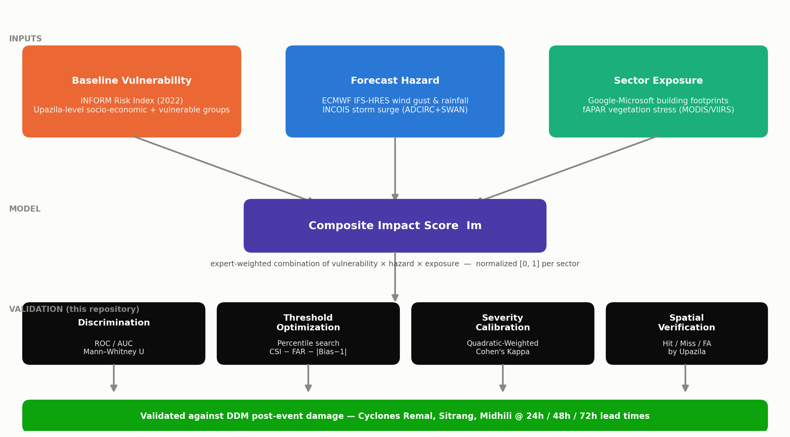
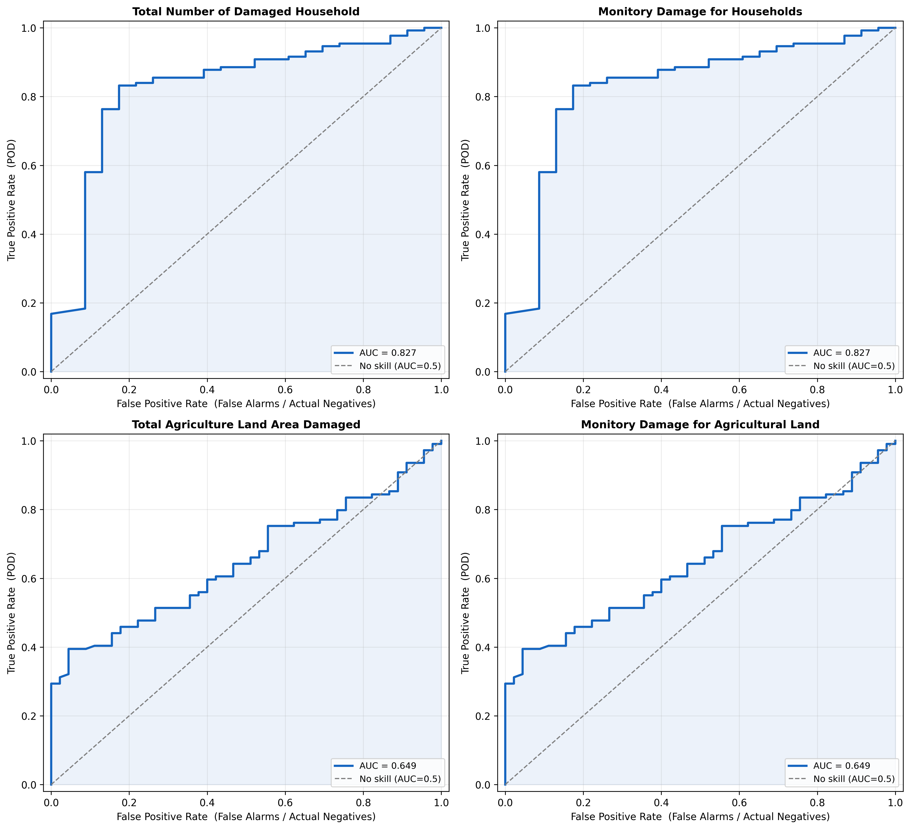
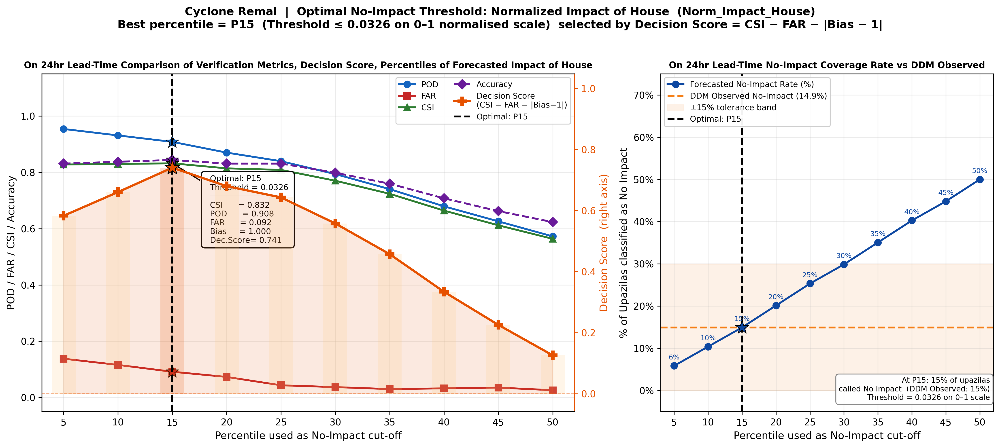
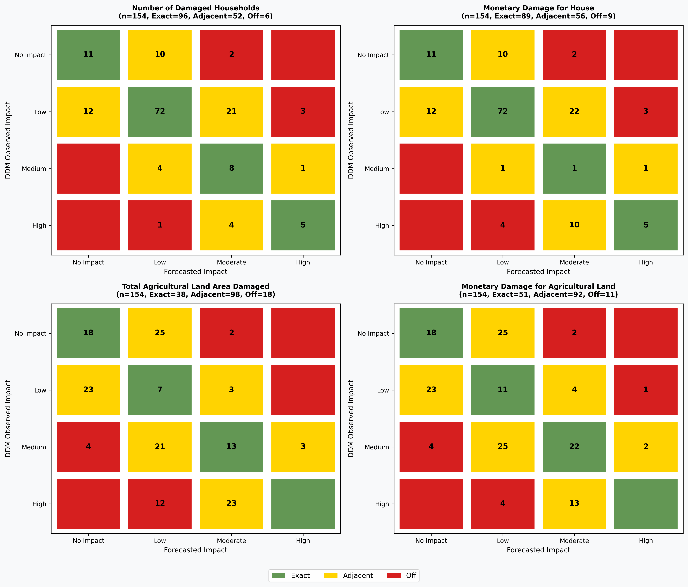

# IBF-Analysis

**A multi-sector impact-forecasting framework for anticipatory action against tropical cyclones in Bangladesh**

Anticipatory action against tropical cyclones requires reliable impact forecasts to guide
pre-landfall resource mobilisation across vulnerable locations. This repository accompanies a
manuscript developed by four researchers at **RIMES** (Regional Integrated Multi-Hazard Early
Warning System for Africa and Asia) — Khan, Noor, Abdullah & Ahmed — submitted to
**npj Natural Hazards**.

The framework integrates forecasted hazards (wind gust, rainfall, storm surge), baseline
vulnerability (INFORM 2022), and sector-specific exposure (building footprints, Fraction of
Absorbed Photosynthetically Active Radiation, fAPAR) into housing and agricultural **impact
scores** across Bangladesh. Pre-landfall predictions at 24-hour, 48-hour, and 72-hour lead
times were validated against Department of Disaster Management (DDM) observed damage records
for Cyclones Remal, Midhili, and Sitrang.

Housing discrimination proved reliable under severe cyclonic forcing but degraded substantially
for lower-intensity events, while agricultural predictions gave more consistent separation
across all event types. Percentile-based threshold optimization resolved systemic
over-forecasting across all events, and Quadratic-Weighted Kappa calibration of the observed
records captured categorical impact significance. Real-world application during Cyclone Remal
demonstrated that calibrated Sub-National-level predictions, embedded in a co-designed
anticipatory action system, can meaningfully reduce pre-landfall damage incidence.

This repository provides the reproducible Python workflow used to validate that framework
against observed post-event damage at the Sub-National level.



## What this framework does

Pre-landfall forecasts (24h, 48h, 72h lead times) combine three inputs into a normalized,
sector-specific **composite impact score** for every Sub-National unit in coastal Bangladesh:

- **Baseline vulnerability** — INFORM Risk Index (2022), Sub-National-level socio-economic and
  vulnerable-groups dimensions.
- **Forecast hazard** — ECMWF IFS-HRES wind gust and rainfall; INCOIS ADCIRC+SWAN storm surge.
- **Sector exposure** — Google–Microsoft building footprints (housing); Fraction of Absorbed
  Photosynthetically Active Radiation (fAPAR) vegetation stress from MODIS/VIIRS (agriculture).

Hazard-component weights are assigned per event by meteorologist assessment rather than a
fixed formula, since the dominant physical driver (wind vs. rainfall vs. surge) varies storm
to storm. See [Reproducibility scope](#reproducibility-scope) for exactly what is and isn't
scripted in this repository.

## Supported cases

| Cyclone | Landfall | 1-day lead | 2-day lead | 3-day lead |
|---|---|---:|---:|---:|
| Remal | 26 May 2024 | ✓ | ✓ | ✓ |
| Sitrang | 24 Oct 2022 | ✓ | ✓ | ✓ |
| Midhili | 17 Nov 2023 | ✓ | ✓ | ✓ |

Lead-time identifiers used in the repository: `1dlt`, `2dlt`, `3dlt`.

## Validation suite

Forecast impact scores are validated against Department of Disaster Management (DDM)
post-event damage records through four complementary analyses:

- **Discrimination (threshold-independent):** ROC / AUC, one-sided Mann–Whitney U
- **Threshold optimization:** percentile search over `Decision Score = CSI − FAR − |Bias − 1|`
  to set the No-Impact boundary
- **Severity calibration:** cyclone-specific DDM severity classes selected by maximizing mean
  Quadratic-Weighted Cohen's Kappa across lead times; Exact / Adjacent / Off-category agreement
- **Spatial verification:** Sub-National-level Hit / Miss / False Alarm / True Negative mapping via
  ADM3 P-Codes

Continuous association (OLS, Pearson r, Spearman ρ, Kendall τ) is also reported on
`log1p`-transformed observed damage, for complete positive forecast–observation pairs.

## Example output (generated from the sample data in this repo)

The figures below were produced by running `scripts/run_analysis.py remal 1dlt` against the
sample data shipped in `data/sample/remal/` — no external inputs required.

**Discrimination skill (ROC / AUC), Cyclone Remal, 24h lead time:**



**No-Impact threshold optimization, Cyclone Remal, housing, 24h lead time:**



**Severity calibration confusion matrices, Cyclone Remal, 24h lead time:**



**Spatial verification, all three cyclones, all four damage variables:**


Sub-National-level Hit (green) vs. False Alarm (red) classification for each of the three validated
cyclones across all four damage variables, corresponding to the manuscript's spatial
verification results (Figure 7).

## Results at a glance (from the manuscript)

| Cyclone | Housing AUC (24h) | Agriculture AUC (24h) | Peak Kappa (sector, lead time) | Off-category error |
|---|---:|---:|---|---:|
| Remal | 0.827 | 0.649 | +0.591 (housing, 48h) | ≤ 7.8% |
| Midhili | 0.580 | 0.730 | +0.645 (agriculture, 24h) | ≤ 3.1% (housing), ≤ 2.0% (agri) |
| Sitrang | 0.503 | 0.617 | +0.325 (agriculture, 24h) | ≤ 9.0% |

Real-world deployment during Cyclone Remal (STEP anticipatory-action project) showed 58%
early-warning reach vs. 36% in non-project areas, 49% vs. 92% damage incidence, and an
estimated 15:1 return on investment. Full statistics, per-lead-time breakdowns, and confidence
intervals are in the manuscript's Tables 1–4 and Supplementary Tables S1–S3.

### Categorical severity classification detail (Cyclone Remal, Table 4b)

Kappa and AUC measure discrimination and ranking; the table below is the direct evidence for
categorical impact prediction — how often the forecast severity class (No Impact / Low /
Moderate / High) landed exactly on, one class away from, or more than one class away from the
DDM-observed severity class, at each lead time.

| Cyclone | Lead Time | Variable | n | Exact Match (n) | Exact Match (%) | Adjacent (n) | Within-1-Class (n) | Within-1-Class (%) | Off-Category Error (%) |
|---|---|---|---:|---:|---:|---:|---:|---:|---:|
| Remal | 24h | House: No. Damaged Households | 154 | 92 | 59.7% | 54 | 146 | 94.8% | 5.2% |
| Remal | 24h | House: Repair Amount (BDT) | 154 | 89 | 57.8% | 56 | 145 | 94.2% | 5.8% |
| Remal | 24h | Agri: Land Loss (ha) | 154 | 38 | 24.7% | 98 | 136 | 88.3% | 11.7% |
| Remal | 24h | Agri: Loss Amount (BDT) | 154 | 51 | 33.1% | 92 | 143 | 92.9% | 7.1% |
| Remal | 48h | House: No. Damaged Households | 154 | 99 | 64.3% | 49 | 148 | 96.1% | 3.9% |
| Remal | 48h | House: Repair Amount (BDT) | 154 | 96 | 62.3% | 51 | 147 | 95.5% | 4.5% |
| Remal | 48h | Agri: Land Loss (ha) | 154 | 54 | 35.1% | 84 | 138 | 89.6% | 10.4% |
| Remal | 48h | Agri: Loss Amount (BDT) | 154 | 57 | 37.0% | 83 | 140 | 90.9% | 9.1% |
| Remal | 72h | House: No. Damaged Households | 154 | 88 | 57.1% | 56 | 144 | 93.5% | 6.5% |
| Remal | 72h | House: Repair Amount (BDT) | 154 | 88 | 57.1% | 56 | 144 | 93.5% | 6.5% |
| Remal | 72h | Agri: Land Loss (ha) | 154 | 53 | 34.4% | 77 | 130 | 84.4% | 15.6% |
| Remal | 72h | Agri: Loss Amount (BDT) | 154 | 57 | 37.0% | 75 | 132 | 85.7% | 14.3% |

Within-1-Class agreement (exact + adjacent) stays at or above 84% for every Remal variable and
lead time; housing reaches 93.5–96.1%. Off-category error — a forecast missing the true
severity class by two or more levels — never exceeds 15.6%, and stays under 10% for both
housing variables at all three lead times. Midhili and Sitrang show the same Exact/Adjacent/
Off-Category structure at generally wider margins, consistent with the lower-intensity
degradation described above; see the manuscript's Table 4b for the full breakdown.

## Repository structure

```text
IBF-Analysis/
│
├── configs/
│   ├── remal.yaml / sitrang.yaml / midhili.yaml   # per-cyclone paths, sheets, output dirs
│   └── earth_engine.yaml                          # Earth Engine project + dataset settings
├── data/
│   ├── reference/bangladesh_adm3/     # BBS ADM3 boundary shapefile
│   └── sample/
│       ├── remal/ sitrang/ midhili/   # forecast + observed-damage sample workbooks
│       └── faapar/<cyclone>/{before,after}/   # optional: raw fAPAR rasters
├── docs/
│   ├── data_dictionary.md
│   ├── transformation_methods.md
│   └── images/            # framework diagram + example outputs (this README)
├── notebooks/01_remal_validation.ipynb   # parameterized validation notebook
├── scripts/
│   ├── check_inputs.py               # pre-run validation for a cyclone/lead time
│   ├── run_analysis.py                # runs the validation notebook
│   ├── fapar_processing.py            # fAPAR raster -> zonal loss (shared implementation)
│   ├── fapar_zonal_stats.py           # per-cyclone CLI wrapper around fapar_processing.py
│   ├── download_building_counts.py    # per-country building counts via Earth Engine
│   ├── transformation_comparison.py
│   └── legacy/
│       ├── IBF-Analysis-original.ipynb
│       └── upazila_building_count_download.js   # original GEE Code Editor script
├── outputs/                # generated per cyclone/lead time (git-ignored)
├── LICENSE
├── CITATION.cff
├── requirements.txt        # loose version constraints
├── requirements-lock.txt   # exact versions verified against this repo's sample data
└── README.md
```

## Installation

Python 3.10+ recommended.

```bash
git clone https://github.com/ibrahim-abdullah16/IBF-Analysis.git
cd IBF-Analysis
python -m venv .venv
source .venv/bin/activate        # Windows: .venv\Scripts\Activate.ps1
python -m pip install --upgrade pip
python -m pip install -r requirements.txt
```

For an exact, previously-verified environment instead of the loose constraints above, use
`pip install -r requirements-lock.txt` instead.

## Running the workflow

```bash
# Check inputs before running
python scripts/check_inputs.py --cyclone remal --lead 1dlt

# Run one cyclone + lead time
python scripts/run_analysis.py remal 1dlt

# Run every cyclone/lead-time combination
python scripts/run_analysis.py --all

# Run interactively
python -m jupyter notebook notebooks/01_remal_validation.ipynb
```

Results are written to `outputs/<cyclone>/<lead>/`, including ROC/AUC figures, threshold and
severity-calibration workbooks, spatial Hit/Miss shapefiles, and the executed notebook.

## Optional preprocessing utilities

Two additional scripts prepare exposure inputs; neither is required to run the validation
workflow above if the forecast workbooks already contain `Norm_Impact_fAPAR` /
`Norm_Impact_House`.

**fAPAR zonal loss** (before/after landfall, per Sub-National unit):

```bash
python scripts/fapar_zonal_stats.py remal
python scripts/fapar_zonal_stats.py --all
```

Reads `data/sample/faapar/<cyclone>/{before,after}/*.tif`, writes
`outputs/<cyclone>/FAPAR/fapar_loss_by_upazila.{csv,xlsx}`.

**Building counts** (any country, via Google Earth Engine):

```bash
python scripts/download_building_counts.py "Bangladesh"
python scripts/download_building_counts.py "India" --export-drive   # large-country fallback
```

One-time setup: set `project` in `configs/earth_engine.yaml` to a Google Cloud project with the
Earth Engine API enabled, then run `earthengine authenticate` once. Writes
`outputs/<country>/BuildingCounts/building_counts_by_district.{csv,xlsx}`. Produces
**district-level** counts (FAO GAUL admin2), not Sub-National-level — see
`docs/data_dictionary.md` §8.

## Reproducibility scope

This repository reproduces the **statistical validation and calibration** reported in the
manuscript (discrimination, threshold optimization, severity calibration, spatial
verification), and includes scripted preprocessing for two of the three exposure inputs
(fAPAR zonal loss, building counts by district). It does **not** include the step that
combines vulnerability, forecast hazard, and exposure into the composite impact score `Im`
itself — that step incorporates a meteorologist-assessed dynamic weighting decision described
in the Methods section rather than a fixed algorithm, and is not automated in the released
code.

## Data sources

- DDM post-event damage records: sample workbooks included under `data/sample/`; full records
  available from the Department of Disaster Management, Bangladesh.
- Bangladesh ADM3 boundaries: Bangladesh Bureau of Statistics (2020), included under
  `data/reference/`.
- fAPAR: [JRC Global fAPAR dataset](https://data.jrc.ec.europa.eu/dataset/1aac79d8-0d68-4f1c-a40f-b6e362264e50)
- Vulnerability: [INFORM Subnational Risk Index — Bangladesh](https://drmkc.jrc.ec.europa.eu/inform-index/INFORM-Subnational-Risk/Bangladesh)
- Building footprints: [Google–Microsoft Open Buildings, via VIDA](https://beta.source.coop/repositories/vida/google-microsoft-open-buildings)
  (manuscript source); `scripts/download_building_counts.py` uses Google's Open Buildings V3
  polygons directly via Earth Engine as a scripted alternative — see that section above.
- Forecast hazard data (ECMWF IFS-HRES, INCOIS storm surge): available from those
  organizations directly, or from the corresponding author on reasonable request.

All third-party data remain subject to their source organizations' terms of use.

## Citation

See [`CITATION.cff`](CITATION.cff). If you use this code, please cite the associated
manuscript once published, and/or the archived software release (DOI to be added after
Zenodo archiving).

## License

Source code is released under the [MIT License](LICENSE). Data under `data/` remains subject
to the terms of its respective source organizations.

## Status

Manuscript under review at npj Natural Hazards. This repository reflects the code state used
to produce the submitted results; see repository tags/releases for the exact version.
